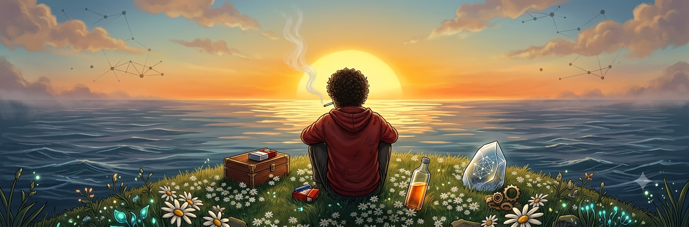
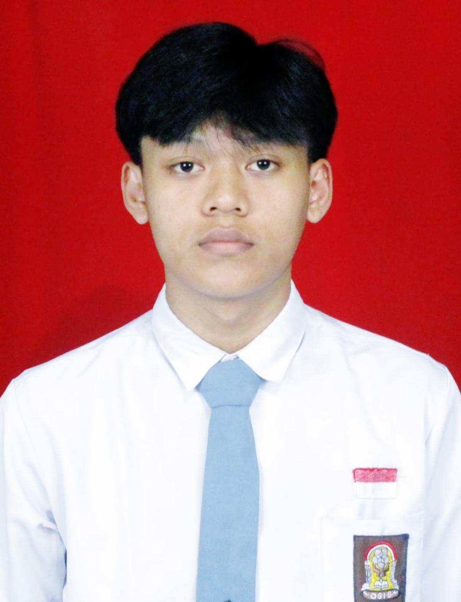

<!-- HEADER BANNER -->

  

## Connect with me

  
  

<table border="0">
  <tr>
    <td width="70%" valign="top">

## About Me

I am a **Network Engineering Student** with a strong passion for web development and cloud infrastructure.

* **Education:** Network Engineering (*Teknik Jaringan*)
* **Specialization:** Full-Stack & Mobile Development (Laravel 12, React Native, Python)
* **Core Interests:** Cloud Infrastructure, Networking, & Linux Administration
* **Collaboration:** Open for Web Apps, Networking, & Mobile Projects

    </td>
    <td width="30%" align="center" valign="middle">
      
    </td>
  </tr>
</table>

---
## 📊 Stats

  

  

  

  

